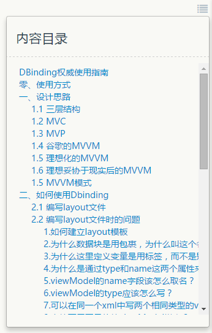

# DBinding   
[](https://jitpack.io/#tianzhijiexian/DBinding)

   
##简介  
**DBinding —— MVVM时代孤独的拓荒者**   

DBinding是一个基于DataBinding的巧妙、灵活的mvvm框架。解决了多个页面的数据同步，跨线程更新UI等问题。意在为开发者提供一个结构清晰、方便分工合作、bug率低的**轻量级**框架。  

##一、优点    
- [x] 完全能替代`findViewById`，会自动建立layout文件的java对象  
- [x] 提供了完全代替R.id.xxx的方案，解决多个界面共用同一id而出现的定位难的问题  
- [x] 不用考虑线程切换的问题，更新UI的操作会自动转到主线程中执行   
- [x] 多个页面的数据可以共通，减少了乏味的多页面回调    
- [x] 提供了在部分情况下代替`onActivityResult`、`Broadcast`的方案   
- [x] 分层清晰，UI层和逻辑层耦合度明显降低，能快速定位问题，真正能**减少bug量**   
- [x] 有数据自动绑定功能，直接对ViewData进行操作便可更新UI    
- [x] 可通过插件自动生成ViewModel，0.9秒内可建立可供整个项目用的所有ViewModel   
- [x] 支持对一个或多个数据进行监听，可极细力度地完成ui逻辑   
- [x] 减少类的全局变量，一个binding变量就能代替界面的所有view变量  
- [x] 节约定义view变量的时间，不用思考某个view到底应该定义在局部还是全局的    

**另：除了以上优点外，就没啥牛逼的地方了。。。**  

##二、示例  


##三、配置lib

1.在项目外层的build.gradle中添加JitPack仓库   

```
repositories {
	maven {
		url "https://jitpack.io"
	}
}
```
2.在项目中添加依赖  
```
dataBinding {
    enabled = true
}
```
> compile 'com.github.tianzhijiexian:DBinding:[Latest release](https://github.com/tianzhijiexian/DBinding/releases)''

3.添加混淆配置

```
-keepclasseswithmembers class * extends android.databinding.ViewDataBinding{  
    <methods>;  
}
```

##四、插件下载  

https://github.com/tianzhijiexian/DBinding/raw/master/Plugin/DBindPlugin.zip   

   

**注意：如果遇到生成不成功的情况，先手动保存当前的文件后再试。**  

##五、使用方式  

1.编写Layout文件：   

```xml   
<layout xmlns:android="http://schemas.android.com/apk/res/android">
    <data>
        <!-- 定义viewData: private org.kale.vd.UserViewModel user -->
        <variable  type="org.kale.vd.UserViewModel" name="user"/>
    </data>


    <!-- 绑定数据: textView.setText(user.name) -->
    <TextView
        android:layout_width="match_parent"
        android:layout_height="match_parent"
        android:text="user.name"/>
</layout>   
```
2.编写java代码：   

```JAVA   
protected void onCreate(Bundle savedInstanceState) {
    super.onCreate(savedInstanceState);

    UserViewModel mUserVm = new UserViewModel();

    DBinding.bindViewModel(this, R.layout.activity_main, mUserVm); // 将vm和layout进行绑定
	mUserVm.setName("kale");  // textview中就会自动渲染出文字了
}
```    

##六、详尽文档  

###[DBinding权威使用指南(重要)](https://www.zybuluo.com/shark0017/note/256112)   



##七、已知问题
1. 因为增加了一个viewModel，所以会有一点重。但是相比起databinding推荐的xml中写java逻辑的写法来看，此框架的复杂度要低很多。   
2. 因为插件的原理是从磁盘中读取layout文件然后根据内容进行viewModel的建立，所以生效的关键点是当前文件有无真正写入磁盘。AS本身的原理是先将当前的编辑内容放入内存，一段时间后再写入磁盘，所以可能会造成插件在某些情况下要点两次的问题。

## 八、改进点
目前对于android中默认属性的支持还不是很完全，但大家可以共同完善它。  
完善的方式：  
1. 通过自定义属性对的方式对插件进行扩展  
2. 对pluginLib这个module中的[TypeFinder](https://github.com/tianzhijiexian/DBinding/blob/master/pluginlib%2Fsrc%2Fmain%2Fjava%2Fkale%2Fdbinding%2Fparser%2FTypeFinder.java)中添加case代码，并提交pull request   
//3. 对dbindingTest这个module中TypeTest进行测试，看是否有未支持的属性

##开发者


Jack Tony: <developer_kale@foxmail.com>  

## License

```  
Copyright 2016 Jack Tony

Licensed under the Apache License, Version 2.0 (the "License");
you may not use this file except in compliance with the License.
You may obtain a copy of the License at

   http://www.apache.org/licenses/LICENSE-2.0

Unless required by applicable law or agreed to in writing, software
distributed under the License is distributed on an "AS IS" BASIS,
WITHOUT WARRANTIES OR CONDITIONS OF ANY KIND, either express or implied.
See the License for the specific language governing permissions and
limitations under the License.
```
